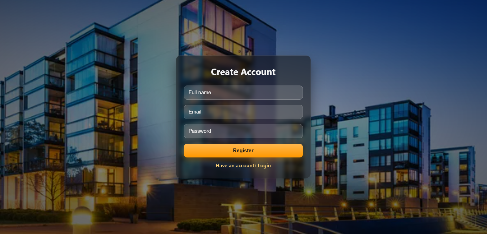
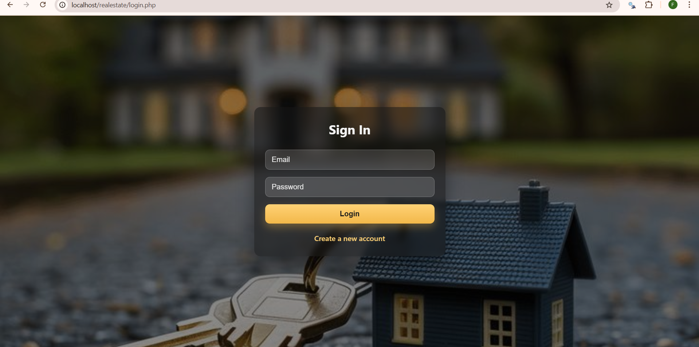
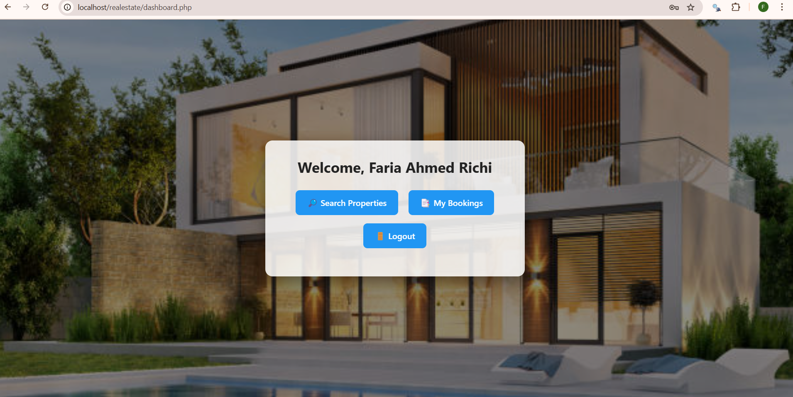
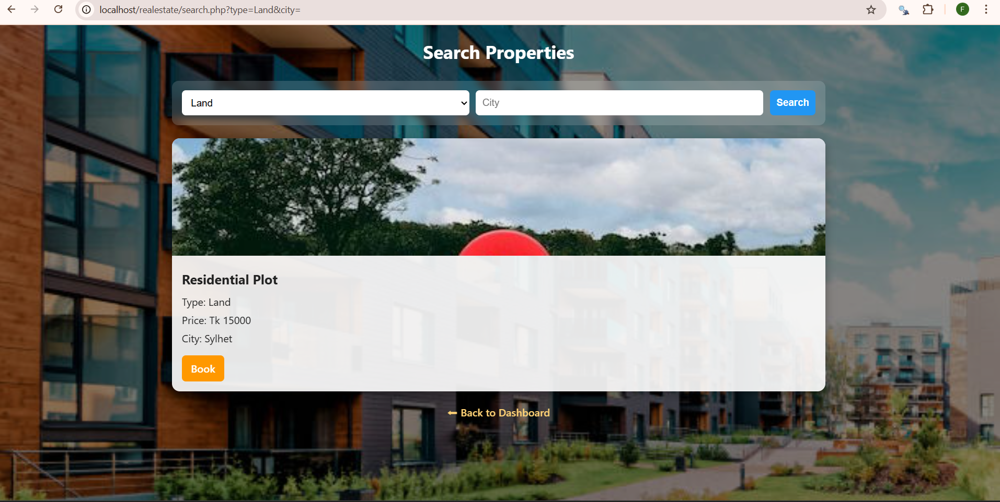
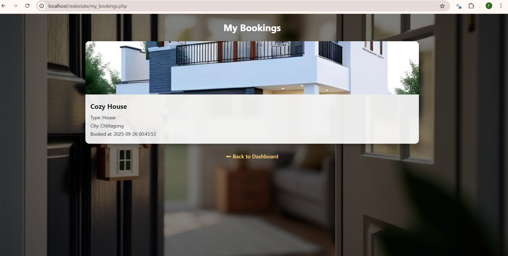

# 🏠 Real Estate Management System

A simple yet functional web application that demonstrates the complete flow of a real estate booking platform.  
Users can register, log in, search properties, view images, and book them. Bookings are stored securely in the database and displayed in each user’s dashboard.

---

## 🚀 Features
- **User Registration & Login** – Secure sign up & sign in with password hashing.  
- **Dashboard** – Personalized landing page with navigation.  
- **Property Listings** – Display properties with images, type, price, and city.  
- **Search & Filter** – Find properties by type (Apartment, House, Land) or city.  
- **Booking System** – Book a property (marked as unavailable once booked).  
- **My Bookings** – View all past bookings with property details & dates.  
- **Logout** – End user session securely.  
- **Basic Validation** – JavaScript checks for input fields.  
- **Styling** – Each page styled with custom backgrounds and CSS for a presentable UI.

---

## 🛠️ Technologies Used
- **Frontend:** HTML, CSS, JavaScript  
- **Backend:** PHP  
- **Database:** MySQL (via phpMyAdmin in XAMPP)  
- **Server Environment:** XAMPP (Apache + MySQL)  

---

## 📂 Project Structure
realestate/
├── db.php # Database connection
├── register.php # User registration page
├── login.php # User login page
├── dashboard.php # Main dashboard after login
├── search.php # Search and view property listings
├── book.php # Handles property booking
├── my_bookings.php # View user's bookings
├── logout.php # Destroy session and logout
├── uploads/ # Property images
└── images/ # Background images for each page

## 📸 Screenshots

### Register Page

### Login Page

### Dashboard

### Search Properties

### My Bookings

---

## 🎯 Purpose
This project was built as part of a **Web Technology course** to practice full-stack development fundamentals (HTML, CSS, JS, PHP, MySQL) and demonstrate a complete working flow in a presentable way.
